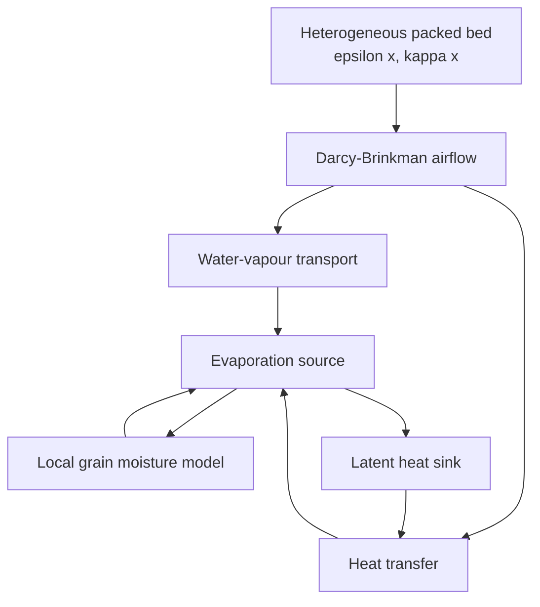
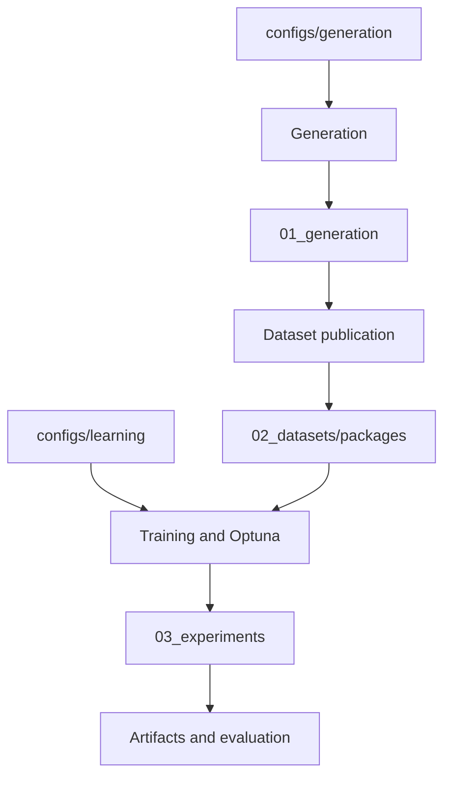

# GrainLegumes-PINO-Drying: Physics-Informed Neural Operators for Porous-Bed Drying
### *Specialization Project 2 (VP2) – MSE Data Science, Spring 2026*

**Master of Science in Engineering – Major Data Science**  
**Eastern Switzerland University of Applied Sciences (OST)**  
**Author:** Rino M. Albertin  
**Supervisor:** Prof. Dr. Christoph Würsch

---

## 📌 Project Overview

This repository develops physics-informed neural operators for airflow and
drying in heterogeneous porous grain beds. Its executable baseline is the
two-dimensional Darcy–Brinkman `steady_flow` task:

**(κ, ε, p_in_bc) → (p, u, v)**

Python generates profile-specific fields and transient inlet schedules, COMSOL
provides reference solutions, and validated outputs are published as immutable
Dataset packages. The established steady workflow trains and evaluates FNO,
U-NO, PI-FNO, and PI-U-NO models. The transient workflow now trains FNO, U-NO,
and official RNO models through an automatic teacher-forced Stage A followed by
autonomous Stage B. Completed-output transient EDA and sequence-aware
Evaluation are available through the maintained notebooks and shared artifact
workflow. See the [Evaluation guide](docs/evaluation.md) and
[transient training guide](docs/transient_training.md).

Generation, Dataset publication, preprocessing, training, resume, and evaluation
are identity-bound and fail closed. Current values, campaign inventories, seeds,
and derived supports are resolved from configuration rather than maintained as
parallel documentation snapshots. The
[identity and provenance policy](docs/simulation_generation.md#identity-and-provenance-policy)
defines which dependencies invalidate each durable stage.

> Configured scientific values are modelling and sampling decisions. Source
> references and resolved evidence classifications distinguish measurements,
> transfers, estimates, derived values, and synthetic assumptions; successful
> software execution does not experimentally validate the science.

## 📄 Project Report

The completed VP1 airflow methodology and results are documented in
[Albertin_2026_PINO_Airflow_PorousMedia.pdf](docs/Albertin_2026_PINO_Airflow_PorousMedia.pdf).
It covers the retained stationary-airflow foundation, not transient drying.

## 🧭 Model Overview



## 📊 Visualization

<p align="center">
  
</p>

<p align="center"><em>Representative stationary-airflow pressure-field comparison for the preserved supervised and physics-informed neural-operator baseline.</em></p>

## 🧭 Main Workflows



| Workflow | Entry point | Guidance |
| --- | --- | --- |
| Run or continue any Generation workflow | `./scripts/generation_workflow.sh run CONFIG` on bare `hpc115` | [Generation operations](docs/simulation_generation.md) |
| Interpret Generation parameters and assumptions | Validated YAML under `configs/generation` | [Scientific parameter reference](docs/generation_parameter_reference.md) |
| Publish declared immutable Dataset packages | Automatic stage of `run CONFIG` | [Generation operations](docs/simulation_generation.md#common-plan-and-lifecycle) |
| Train, tune, and build artifacts | `src.experiments.cli` commands | Commands below and `configs/learning` |
| Train transient A0 then B | One architecture-first YAML under `configs/learning/transient_drying/experiments` | [Transient training](docs/transient_training.md) |

The stable package facades are `src.generation` and `src.datasets`. Reusable
logic lives under `src/`; command-line modules, notebooks, and shell wrappers
remain thin orchestration surfaces.

## ⚙️ Configuration and Quick Start

Edit Generation science, materials, operations, campaigns, profiles, and CPU
execution under `configs/generation`. Edit model, optimizer, training, and
evaluation decisions under `configs/learning/<task>`. Use `validate-config` to
inspect the resolved plan instead of copying current values into Markdown.

For local development, install Git, Docker, Visual Studio Code, and the Dev
Containers extension. NVIDIA Container Toolkit is required for GPU workflows.

```bash
git clone https://github.com/Rinovative/grainlegumes-pino-drying.git
cd grainlegumes-pino-drying
./scripts/docker_build.sh
./scripts/docker_dev.sh
```

Attach Visual Studio Code to `grainlegumes-pino-drying-dev` and open
`/workspace/repo`.

Generation workflow commands run from the bare `hpc115` checkout. Start with:

```bash
./scripts/generation_workflow.sh --help
./scripts/generation_workflow.sh run \
  configs/generation/campaigns/steady_flow/id_dataset.yaml
```

Inside the development container, the established learning commands are:

```bash
python -m src.experiments.cli.cli_config_preflight train <experiment_config>
python -m src.experiments.cli.cli_train <experiment_config>
python -m src.experiments.cli.cli_optuna <optuna_config>
python -m src.experiments.cli.cli_build_artifacts --task steady_flow
python -m src.experiments.cli.cli_build_artifacts --task transient_drying --evaluation-spatial-stride 1
```

For transient drying, one normal architecture config automatically persists its
Stage A0 best-model handoff and then starts a separately named Stage B run. The
CLI prints both run directories. `notebooks/eda.ipynb` exposes admitted
`steady_flow` and `transient_drying` datasets in one capability-adaptive panel
with no task selector. Discovery preserves strict terminal batches while admitting
independently valid completed cases from partial or failed campaigns.
Completed transient runs use the same
task-aware post-training artifact service. `notebooks/eval_single_model.ipynb` and
`notebooks/eval_comparison_models.ipynb` automatically discover persisted runs,
load only validated Evaluation artifacts, preserve absent OOD roles as absent,
and render transient-specific panels and local reports. Artifact commands,
controls, and loading behavior are in the [Evaluation guide](docs/evaluation.md);
comparison semantics and resume rules are in the
[transient training guide](docs/transient_training.md).

From the host, `scripts/docker_job.sh` supplies the corresponding GPU-queue
workflow.

## 💾 Storage and Results

`STORAGE_ROOT` is the sole scientific storage-root override. It defaults to the
`storage` sibling of the repository; maintained containers expose it as
`/workspace/storage`. Generated data do not belong in the Git checkout.

```text
STORAGE_ROOT/
├── 01_generation/   # canonical simulation source and provenance
├── 02_datasets/
│   ├── packages/     # immutable learning payloads addressed by dataset_id
│   ├── meta/         # package manifests and validated metadata
│   └── .state/       # publication coordination only
└── 03_experiments/  # training, tuning, logs, and analysis artifacts
```

Generation source is retained independently of Dataset packages. Canonical
completed science lives in <code>case.h5</code>; compact Production publications
retain neither direct COMSOL CSV exports nor <code>solved.mph</code>. Cleanup of
CPU source must use the gated Generation workflow; it never removes the
canonical GPU-side publication. Immutable Dataset packages use the sole
<code>02_datasets/packages</code> root.

## ✅ Maintained Validation

```bash
python scripts/check_package_install.py
python scripts/check_notebooks.py
python -m ruff check notebooks
python -m ruff check src tests scripts/check_notebooks.py scripts/check_package_install.py scripts/config_preflight_runtime.py
python -m ruff format --check src tests scripts/check_notebooks.py scripts/check_package_install.py scripts/config_preflight_runtime.py --exclude '*.ipynb'
python -m mypy src
python -m basedpyright
python -m compileall -q src scripts/check_notebooks.py scripts/check_package_install.py scripts/config_preflight_runtime.py
python -m pytest -q -m "not real_data" tests
```

## 📂 Repository Structure

<details>
<summary><strong>Show project tree</strong></summary>

```text
.
├── .github/workflows/quality.yml
├── .vscode/settings.json
├── configs/
│   ├── generation/
│   └── learning/
│       ├── steady_flow/
│       └── transient_drying/
├── docs/
├── notebooks/
├── scripts/
├── simulation/
│   ├── steady_flow/
│   │   ├── steady_flow_template.mph
│   │   └── steady_flow_template.sha256
│   └── transient_drying/
│       ├── transient_drying_template.mph
│       └── transient_drying_template.sha256
├── src/
│   ├── analysis/
│   ├── common/
│   ├── datasets/
│   ├── domain/
│   ├── experiments/
│   ├── generation/
│   └── learning/
├── tests/
├── Dockerfile
├── environment.yml
├── environment-dev.yml
├── pyproject.toml
└── README.md
```

`src` is the only importable production Python package. Supported top-level
imports are:

```python
from src import analysis, common, datasets, domain, experiments, generation, learning
```

</details>

## 📄 License

This project is released under the [Apache License 2.0](LICENSE.md).

## 📚 References

- Li et al. (2020), *Fourier Neural Operator for Parametric Partial Differential Equations*.
- Rahman et al. (2022), *U-NO: U-shaped Neural Operators*.
- Li et al. (2021), *Physics-Informed Neural Operator for Learning Partial Differential Equations*.
- COMSOL Multiphysics, Darcy–Brinkman formulation and LiveLink for MATLAB.
