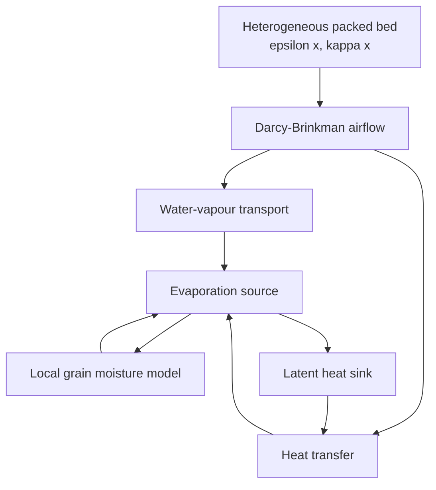

# GrainLegumes-PINO-Drying: Physics-Informed Neural Operators for Coupled Porous-Bed Drying
### *Specialization Project (VP1) – MSE Data Science, Spring 2026*

**Master of Science in Engineering – Major Data Science**  
**Eastern Switzerland University of Applied Sciences (OST)**  
**Author:** Rino M. Albertin  
**Supervisor:** Prof. Dr. Christoph Würsch  

---

  

<em>
Coupled porous-bed drying model including Darcy-Brinkman airflow, water-vapour transport, heat transfer, evaporation and a local two-state grain moisture model.
</em>

---

## 📌 Project Overview

This project extends the previous GrainLegumes-PINO airflow work towards a coupled drying model for grain-legume packed beds.

The central objective is to develop a physics-informed neural-operator pipeline for simulating coupled **airflow**, **heat transfer**, **water-vapour transport** and **local grain-moisture dynamics** in heterogeneous porous media.

The physical reference model combines Darcy-Brinkman airflow with transient heat and moisture transport. Local grain drying is represented by an internal/surface two-state moisture model coupled to evaporation, latent heat consumption and equilibrium moisture content.

The long-term goal is to train neural-operator surrogate models that can approximate expensive COMSOL-based reference simulations and support future control-oriented drying strategies.

The repository is intended to provide a modular workflow covering:

<strong>🧩 Reference model and data generation</strong>

A simulation pipeline for generating coupled porous-bed drying data, including:
- heterogeneous porosity and permeability fields
- Darcy-Brinkman airflow through the packed bed
- transient heat transfer with convective transport and wall heat losses
- water-vapour transport with advection, diffusion and evaporation source terms
- local grain moisture dynamics with internal and surface moisture states
- COMSOL-based reference simulation and export of training data

<strong>⚙️ Neural-operator surrogate modelling</strong>

A planned training framework for physics-informed neural operators, including:
- coupled multi-field input and output representations
- surrogate modelling of airflow, temperature, humidity and moisture states
- physics-informed loss terms based on the governing equations
- comparison between data-driven and physics-informed neural-operator variants

<strong>📊 Evaluation and diagnostics</strong>

A planned evaluation suite for analysing surrogate quality, including:
- field-wise prediction errors
- physical residuals and conservation checks
- temporal drying behaviour
- sensitivity to permeability, porosity and inlet conditions
- control-oriented model assessment

---

## 🧭 Model Overview

The coupled drying model consists of four interacting components:

---

## 📚 Reference

Kossaifi, J., Kovachki, N., Li, Z., Pitt, D., Liu-Schiaffini, M., Duruisseaux, V., George, R. J., Bonev, B., Azizzadenesheli, K., Berner, J., & Anandkumar, A. (2025).  
*A Library for Learning Neural Operators.*  
*arXiv preprint* [arXiv:2412.10354](https://arxiv.org/abs/2412.10354)