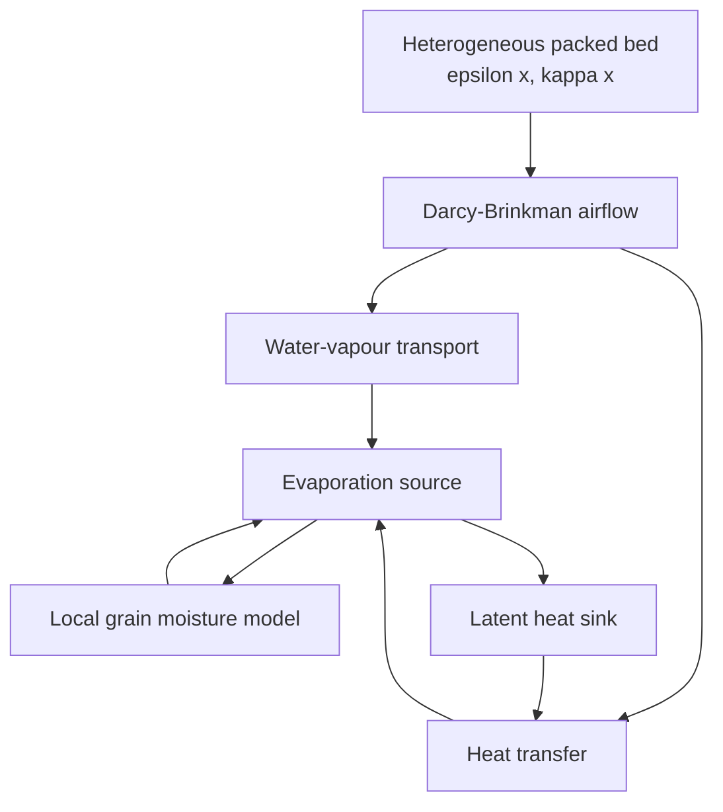
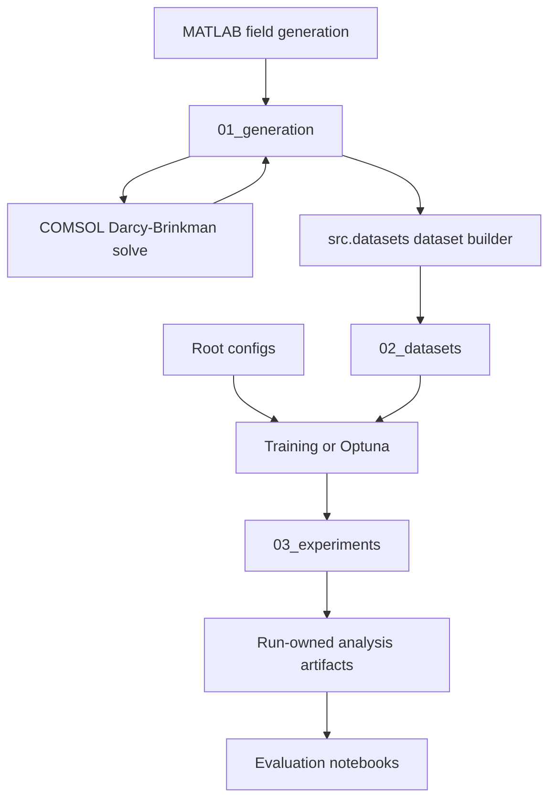

# GrainLegumes-PINO-Drying: Physics-Informed Neural Operators for Porous-Bed Drying
### *Specialization Project 2 (VP2) – MSE Data Science, Spring 2026*

**Master of Science in Engineering – Major Data Science**  
**Eastern Switzerland University of Applied Sciences (OST)**  
**Author:** Rino M. Albertin  
**Supervisor:** Prof. Dr. Christoph Würsch

---

## 📌 Project Overview

This repository is the VP2 continuation of the completed stationary-airflow project. Its current executable scientific foundation is the preserved two-dimensional Darcy–Brinkman `steady_flow` task:

**(κ, ε, p_bc) → (p, u, v)**

Heterogeneous permeability and porosity fields are generated in MATLAB, solved with COMSOL, admitted through strict manifest and hash contracts, published as immutable tensor datasets, and used to train and evaluate FNO, U-NO, PI-FNO, and PI-U-NO models.

The repository now has one Python package, one research layout, and one external scientific storage root. Existing dataset identity, train-only normalization, deterministic training, exact resume, Optuna, W&B observation, run publication, artifact generation, and ID/OOD evaluation contracts remain the stationary-airflow baseline for subsequent drying work.

Transient drying physics, heat and moisture transport, evaporation, rollout training, and drying-specific evaluation are not implemented yet.

<details>
<summary><strong>Current stationary-airflow workflow</strong></summary>

- MATLAB generation of heterogeneous fields and inlet pressure conditions
- COMSOL Darcy–Brinkman reference solutions
- Strict generated-batch admission and atomic final-dataset publication
- FNO, U-NO, and physics-informed training
- Deterministic checkpoints and exact resume
- Optuna tuning and W&B observability
- Run-owned ID/OOD artifacts and bounded notebook evaluation

</details>

## 📄 Project Report

The completed VP1 airflow methodology and results are documented in [Albertin_2026_PINO_Airflow_PorousMedia.pdf](docs/Albertin_2026_PINO_Airflow_PorousMedia.pdf). It describes the stationary-airflow foundation retained here; it is not a report of transient drying functionality.

## 🧭 Model Overview

The coupled drying model consists of:



## 📊 Visualization

<p align="center">
  
</p>

<p align="center"><em>Representative stationary-airflow pressure-field comparison for the preserved supervised and physics-informed neural-operator baseline.</em></p>

## 🧭 Data Flow Overview



## ⚙️ Local Execution

<details>
<summary><strong>Run via Docker</strong></summary>

### Recommended: Docker development container

Install Git, Docker, and Visual Studio Code with the Dev Containers extension. NVIDIA Container Toolkit is required for GPU workflows.

```bash
git clone https://github.com/Rinovative/grainlegumes-pino-drying.git
cd grainlegumes-pino-drying
./scripts/docker_build.sh
./scripts/docker_dev.sh
```

Attach Visual Studio Code to `grainlegumes-pino-drying-dev` and open `/workspace/repo`.

### Scientific storage

`STORAGE_ROOT` is the only scientific storage-root override. It defaults to the `storage` directory beside the repository and is mounted at `/workspace/storage` in maintained containers.

```bash
export STORAGE_ROOT=/absolute/path/to/storage
```

The authoritative lifecycle is:

```text
STORAGE_ROOT/
├── 01_generation/
│   ├── meta/
│   ├── raw/
│   ├── processed/
│   └── .state/
├── 02_datasets/
│   ├── meta/
│   ├── raw/
│   └── .state/
└── 03_experiments/
    ├── <task>/runs/
    ├── <task>/studies/
    ├── <task>/logs/
    └── .state/
```

Generated solver inputs and solutions, immutable final datasets, and experiment bundles remain separate. Analysis artifacts stay inside their owning run directories.

### Dataset publication

Build one final dataset from a completed generated batch:

```bash
cd /workspace/repo
python -m src.datasets.dataset_build <batch_id>
```

The command reads `01_generation` and atomically publishes validated metadata and the immutable tensor payload into `02_datasets`.

### Train, tune, and build artifacts

Inside the development container:

```bash
cd /workspace/repo
python -m src.experiments.cli.cli_config_preflight train <experiment_config>
python -m src.experiments.cli.cli_train <experiment_config>
python -m src.experiments.cli.cli_optuna <optuna_config>
python -m src.experiments.cli.cli_build_artifacts --task steady_flow
```

From the host, use the GPU queue wrapper. It additionally requires `nvidia-smi` and a configured `runTSGPU.py` command:

```bash
./scripts/docker_job.sh train <experiment_config> --queue-gpu auto
./scripts/docker_job.sh optuna <optuna_config> --queue-gpu auto
./scripts/docker_job.sh artifacts --task steady_flow --queue-gpu auto
```

Production configurations are under `configs/tasks/steady_flow`. The maintained notebooks are under `notebooks`.

### Maintained validation

```bash
python scripts/check_package_install.py
python scripts/check_notebooks.py
ruff check notebooks
ruff check src tests scripts/check_notebooks.py scripts/check_package_install.py scripts/config_preflight_runtime.py
ruff format --check src tests scripts/check_notebooks.py scripts/check_package_install.py scripts/config_preflight_runtime.py --exclude '*.ipynb'
mypy src
python -m basedpyright
python -m compileall -q src scripts/check_notebooks.py scripts/check_package_install.py scripts/config_preflight_runtime.py
python -m pytest -q -m "not real_data" tests
```
</details>

## 📂 Repository Structure

<details>
<summary><strong>Show project tree</strong></summary>

```text
.
├── .github/workflows/quality.yml
├── .vscode/settings.json
├── configs/
│   └── tasks/steady_flow/
├── docs/
├── notebooks/
├── scripts/
├── simulation/
│   └── steady_flow/
│       ├── comsol/template_brinkman.mph
│       └── matlab/
├── src/
│   ├── analysis/
│   ├── common/
│   ├── datasets/
│   ├── domain/
│   ├── experiments/
│   └── learning/
├── tests/
├── Dockerfile
├── environment.yml
├── environment-dev.yml
├── pyproject.toml
└── README.md
```

`src` is the only importable production Python package. Supported top-level imports are:

```python
from src import analysis, common, datasets, domain, experiments, learning
```

</details>

## 📄 License

This project is released under the [Apache License 2.0](LICENSE.md).

## 📚 References

- Li et al. (2020), *Fourier Neural Operator for Parametric Partial Differential Equations*.
- Rahman et al. (2022), *U-NO: U-shaped Neural Operators*.
- Li et al. (2021), *Physics-Informed Neural Operator for Learning Partial Differential Equations*.
- COMSOL Multiphysics, Darcy–Brinkman formulation and LiveLink for MATLAB.
