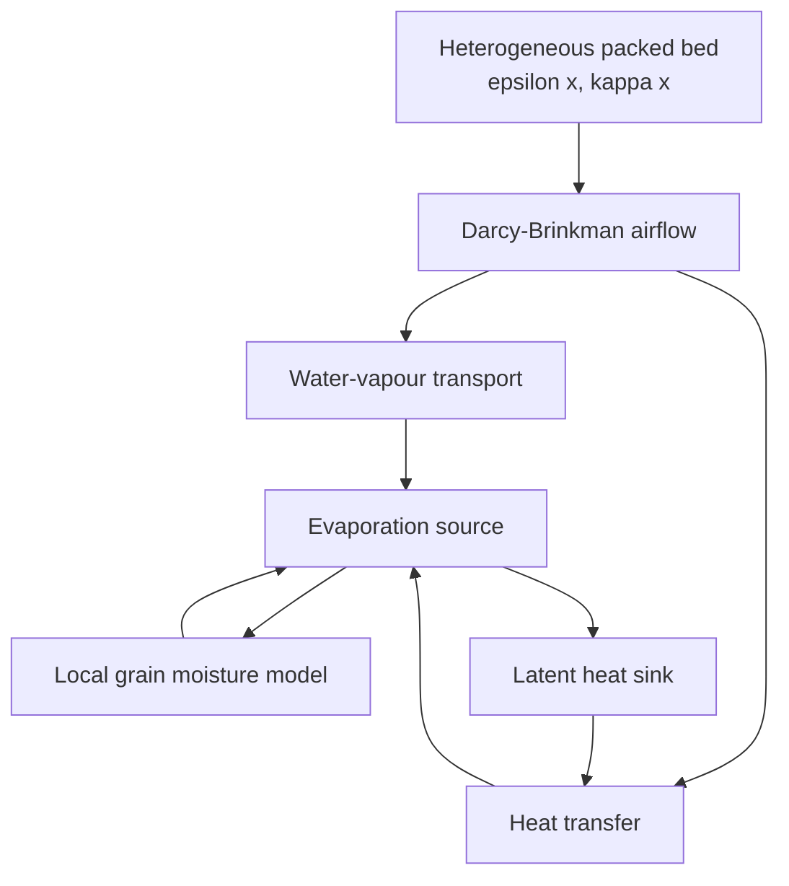
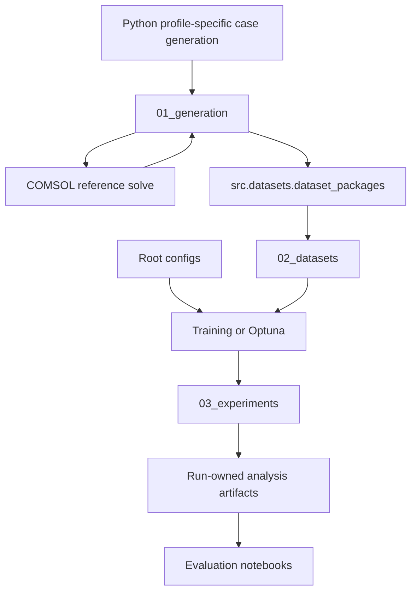

# GrainLegumes-PINO-Drying: Physics-Informed Neural Operators for Porous-Bed Drying
### *Specialization Project 2 (VP2) – MSE Data Science, Spring 2026*

**Master of Science in Engineering – Major Data Science**  
**Eastern Switzerland University of Applied Sciences (OST)**  
**Author:** Rino M. Albertin  
**Supervisor:** Prof. Dr. Christoph Würsch

---

## 📌 Project Overview

This repository is the VP2 continuation of the completed stationary-airflow project. Its current executable scientific foundation is the preserved two-dimensional Darcy–Brinkman `steady_flow` task:

**(κ, ε, p_in_bc) → (p, u, v)**

Heterogeneous permeability, porosity, pressure, and initial-moisture fields are generated by the Python generation package, solved through profile-specific COMSOL cases, admitted through strict manifest and hash contracts, and published as immutable dual-view dataset packages. The established steady view trains and evaluates FNO, U-NO, PI-FNO, and PI-U-NO models.

The repository now has one Python package, one research layout, and one external scientific storage root. Existing dataset identity, train-only normalization, deterministic training, exact resume, Optuna, W&B observation, run publication, artifact generation, and ID/OOD evaluation contracts remain the stationary-airflow baseline for subsequent drying work.

Generation and publication are fail-closed. Campaign inventories, roles, counts, memberships, seeds, package requests, OOD allocations, and execution resources are resolved from their authoritative YAML owners instead of being repeated in documentation. `validate-config` displays the complete effective plan and current launch gates before any runtime work. Transient learning, rollout, tuning, EDA, and evaluation are intentionally not implemented.

> Configured scientific values are modelling and sampling decisions. Citations do
> not imply that every final number is reported verbatim: values may be fitted,
> converted, transferred, inverted, estimated, selected as priors, or synthetic.
> Resolved `status`, `derivation`, `confidence`, and `validity` are authoritative;
> technical smoke evidence does not experimentally validate the science.

<details>
<summary><strong>Current stationary-airflow workflow</strong></summary>

- Deterministic Python generation of profile-specific fields, scalar handoff, and transient schedules
- COMSOL Darcy–Brinkman reference solutions
- Strict generated-batch admission and atomic final-dataset publication
- FNO, U-NO, and physics-informed training
- Deterministic checkpoints and exact resume
- Optuna tuning and W&B observability
- Run-owned ID/OOD artifacts and bounded notebook evaluation

</details>

## 📄 Project Report

The completed VP1 airflow methodology and results are documented in [Albertin_2026_PINO_Airflow_PorousMedia.pdf](docs/Albertin_2026_PINO_Airflow_PorousMedia.pdf). It describes the stationary-airflow foundation retained here; it is not a report of transient drying functionality.

## 🧭 Model Overview

The coupled drying model consists of:



## 📊 Visualization

<p align="center">
  
</p>

<p align="center"><em>Representative stationary-airflow pressure-field comparison for the preserved supervised and physics-informed neural-operator baseline.</em></p>

## 🧭 Data Flow Overview



## ⚙️ Generation Gateway

Run generation orchestration on the GPU/development host outside Docker. The
current readiness report is non-solving and will remain blocked until the
reported scientific and native-runtime gates are cleared:

```bash
cd /workspace/repo
python -m src.generation.cli.cli_generation readiness-report \
  configs/generation/campaigns/steady_flow/family_generalization.yaml \
  configs/generation/campaigns/transient_drying/family_generalization.yaml \
  --run-static-sentinels
```

The configured transient diagnostic, once those gates pass, is:

```bash
./scripts/generation_workflow.sh pilot-check \
  configs/generation/campaigns/transient_drying/pilot_check.yaml
```

See the [generation workflow](docs/simulation_generation.md) for setup, mapping
probe, smoke, plan, cleanup, status, and resume commands, and the
[parameter reference](docs/generation_parameter_reference.md) for scientific
ownership and provenance inspection.

## ⚙️ Local Execution

<details>
<summary><strong>Run via Docker</strong></summary>

### Recommended: Docker development container

Install Git, Docker, and Visual Studio Code with the Dev Containers extension. NVIDIA Container Toolkit is required for GPU workflows.

```bash
git clone https://github.com/Rinovative/grainlegumes-pino-drying.git
cd grainlegumes-pino-drying
./scripts/docker_build.sh
./scripts/docker_dev.sh
```

Attach Visual Studio Code to `grainlegumes-pino-drying-dev` and open `/workspace/repo`.

### Scientific storage

`STORAGE_ROOT` is the only scientific storage-root override. It defaults to the canonical `storage` sibling beside the repository. A host checkout at `<project-parent>/repo` therefore uses `<project-parent>/storage`; maintained containers expose those same owners as `/workspace/repo` and `/workspace/storage`. Generated data are never published inside the Git checkout.

```bash
export STORAGE_ROOT=/absolute/path/to/storage
```

The authoritative lifecycle is:

```text
STORAGE_ROOT/
├── 01_generation/
│   ├── meta/
│   ├── raw/
│   ├── processed/
│   └── .state/
│       └── transfer-staging/   # disposable, marked collection staging
├── 02_datasets/
│   ├── meta/
│   ├── raw/
│   └── .state/
└── 03_experiments/
    ├── <task>/runs/
    ├── <task>/studies/
    ├── <task>/logs/
    └── .state/
```

`01_generation` is the retained high-fidelity source/provenance archive. `02_datasets` contains immutable learning views addressed by `dataset_id`; it is not a renamed campaign directory. The steady view materializes its task-owned tensor payload, while transient packages keep compact indexes with storage-relative `case.h5` paths and open those canonical sources lazily and read-only. Consequently, successful package construction never removes GPU `01_generation`. Experiment bundles and analysis artifacts remain under `03_experiments`.

### Dataset publication

Build or exactly reuse every package declared by one collected terminal campaign:

```bash
cd /workspace/repo
./scripts/generation_workflow.sh build-datasets "$GENERATION_RUN_ID"
```

Training and Optuna configurations select those immutable dataset IDs. Dataset and DataLoader construction resolves the validated package first; it does not accept generation-run IDs, raw `case.h5` paths, generation globs, or transfer staging. See [simulation generation](docs/simulation_generation.md) for the primitive and all-in-one workflows, cleanup gates, profile contracts, and real sentinel commands.

### Train, tune, and build artifacts

Inside the development container:

```bash
cd /workspace/repo
python -m src.experiments.cli.cli_config_preflight train <experiment_config>
python -m src.experiments.cli.cli_train <experiment_config>
python -m src.experiments.cli.cli_optuna <optuna_config>
python -m src.experiments.cli.cli_build_artifacts --task steady_flow
```

From the host, use the GPU queue wrapper. It additionally requires `nvidia-smi` and a configured `runTSGPU.py` command:

```bash
./scripts/docker_job.sh train <experiment_config> --queue-gpu auto
./scripts/docker_job.sh optuna <optuna_config> --queue-gpu auto
./scripts/docker_job.sh artifacts --task steady_flow --queue-gpu auto
```

Production configurations are under `configs/tasks/steady_flow`. The maintained notebooks are under `notebooks`.

### Maintained validation

```bash
python scripts/check_package_install.py
python scripts/check_notebooks.py
python -m ruff check notebooks
python -m ruff check src tests scripts/check_notebooks.py scripts/check_package_install.py scripts/config_preflight_runtime.py
python -m ruff format --check src tests scripts/check_notebooks.py scripts/check_package_install.py scripts/config_preflight_runtime.py --exclude '*.ipynb'
python -m mypy src
python -m basedpyright
python -m compileall -q src scripts/check_notebooks.py scripts/check_package_install.py scripts/config_preflight_runtime.py
python -m pytest -q -m "not real_data" tests
```
</details>

## 📂 Repository Structure

<details>
<summary><strong>Show project tree</strong></summary>

```text
.
├── .github/workflows/quality.yml
├── .vscode/settings.json
├── configs/
│   └── tasks/steady_flow/
├── docs/
├── notebooks/
├── scripts/
├── simulation/
│   ├── steady_flow/
│   │   ├── steady_flow_template.mph
│   │   └── steady_flow_template.sha256
│   └── transient_drying/
│       ├── transient_drying_template.mph
│       └── transient_drying_template.sha256
├── src/
│   ├── analysis/
│   ├── common/
│   ├── datasets/
│   ├── domain/
│   ├── experiments/
│   ├── generation/
│   └── learning/
├── tests/
├── Dockerfile
├── environment.yml
├── environment-dev.yml
├── pyproject.toml
└── README.md
```

`src` is the only importable production Python package. Supported top-level imports are:

```python
from src import analysis, common, datasets, domain, experiments, generation, learning
```

</details>

## 📄 License

This project is released under the [Apache License 2.0](LICENSE.md).

## 📚 References

- Li et al. (2020), *Fourier Neural Operator for Parametric Partial Differential Equations*.
- Rahman et al. (2022), *U-NO: U-shaped Neural Operators*.
- Li et al. (2021), *Physics-Informed Neural Operator for Learning Partial Differential Equations*.
- COMSOL Multiphysics, Darcy–Brinkman formulation and LiveLink for MATLAB.
