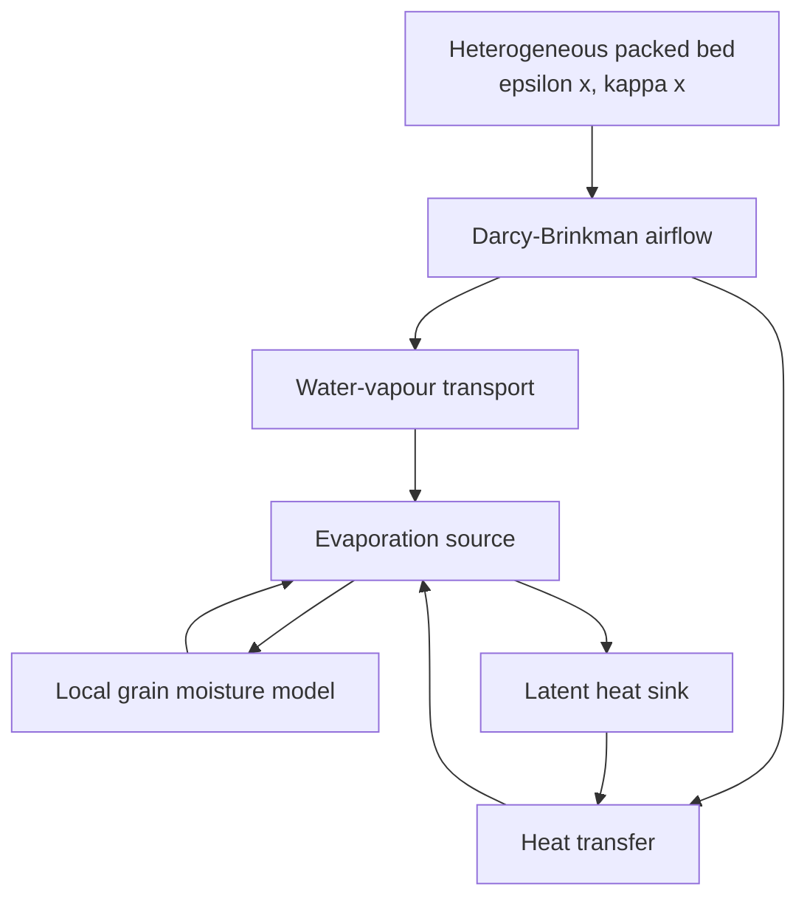
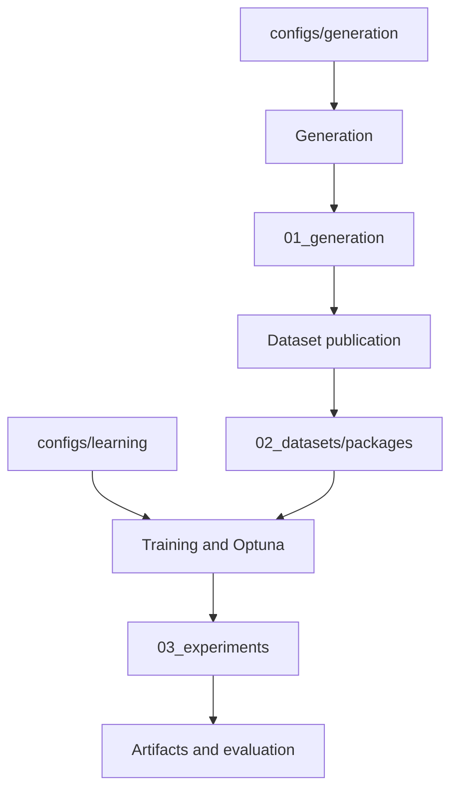

# GrainLegumes-PINO-Drying: Physics-Informed Neural Operators for Porous-Bed Drying
### *Specialization Project 2 (VP2) – MSE Data Science, Spring 2026*

**Master of Science in Engineering – Major Data Science**  
**Eastern Switzerland University of Applied Sciences (OST)**  
**Author:** Rino M. Albertin  
**Supervisor:** Prof. Dr. Christoph Würsch

---

## 📌 Project Overview

This repository develops physics-informed neural operators for airflow and
drying in heterogeneous porous grain beds. Its executable baseline is the
two-dimensional Darcy–Brinkman `steady_flow` task:

**(κ, ε, p_in_bc) → (p, u, v)**

Python generates profile-specific fields and transient inlet schedules, COMSOL
provides reference solutions, and validated outputs are published as immutable
Dataset packages. The established steady workflow trains and evaluates FNO,
U-NO, PI-FNO, and PI-U-NO models. The transient workflow now trains FNO, U-NO,
and official RNO models through an automatic teacher-forced Stage A followed by
autonomous Stage B. Completed-output transient EDA and sequence-aware
Evaluation are available through the maintained notebooks and shared artifact
workflow. See the [Evaluation guide](docs/evaluation.md) and
[transient training guide](docs/transient_training.md).

Generation, Dataset publication, preprocessing, training, resume, and evaluation
are identity-bound and fail closed. Current values, campaign inventories, seeds,
and derived supports are resolved from configuration rather than maintained as
parallel documentation snapshots. The
[source admission and lifecycle](docs/simulation_generation.md#source-admission-and-lifecycle)
defines which dependencies invalidate each durable stage.

> Configured scientific values are modelling and sampling decisions. Source
> references and resolved evidence classifications distinguish measurements,
> transfers, estimates, derived values, and synthetic assumptions; successful
> software execution does not experimentally validate the science.

## 📄 Project Report

The completed VP1 airflow methodology and results are documented in
[Albertin_2026_PINO_Airflow_PorousMedia.pdf](docs/Albertin_2026_PINO_Airflow_PorousMedia.pdf).
It covers the retained stationary-airflow foundation, not transient drying.

## 🧭 Model Overview


```mermaid
graph TD
A[Heterogeneous packed bed<br/>epsilon x, kappa x] --> B[Darcy-Brinkman airflow]
B --> C[Water-vapour transport]
B --> D[Heat transfer]
C --> E[Evaporation source]
D --> E
E --> F[Local grain moisture model]
F --> E
E --> G[Latent heat sink]
G --> D
```

## 📊 Visualization

<p align="center">
  
</p>

<p align="center"><em>Representative stationary-airflow pressure-field comparison for the preserved supervised and physics-informed neural-operator baseline.</em></p>

## 🧭 Main Workflows


```mermaid
flowchart TD
    C[configs/generation] --> G[Generation]
    G --> S[01_generation]
    S --> D[Dataset publication]
    D --> P[02_datasets/packages]
    L[configs/learning] --> T[Training and Optuna]
    P --> T
    T --> E[03_experiments]
    E --> A[Artifacts and evaluation]
```

| Workflow | Entry point | Guidance |
| --- | --- | --- |
| Run or continue any Generation workflow | `./scripts/generation_workflow.sh run CONFIG` on ICE | [Generation operations](docs/simulation_generation.md) |
| Interpret Generation parameters and assumptions | Validated YAML under `configs/generation` | [Scientific parameter reference](docs/generation_parameter_reference.md) |
| Publish declared immutable Dataset packages | Automatic stage of `run CONFIG` | [Generation operations](docs/simulation_generation.md#source-admission-and-lifecycle) |
| Submit training | `./scripts/slurm_ml.sh ... train CONFIG` on ICE | Commands below and `configs/learning` |
| Tune and build standalone artifacts | `./scripts/slurm_ml.sh ... optuna CONFIG` or `... artifacts ...` on ICE | Commands below |
| Train transient A0 then B | One architecture-first YAML under `configs/learning/transient_drying/experiments` | [Transient training](docs/transient_training.md) |

The stable package facades are `src.generation` and `src.datasets`. Reusable
logic lives under `src/`; command-line modules, notebooks, and shell wrappers
remain thin orchestration surfaces.

## ⚙️ Configuration and Quick Start

Edit Generation science, materials, operations, campaigns, profiles, and CPU
execution under `configs/generation`. Edit model, optimizer, training, and
evaluation decisions under `configs/learning/<task>`. Use `validate-config` to
inspect the resolved plan instead of copying current values into Markdown.

Open the outer project folder
`/zfspool/storage/home/rino.albertin/work/grainlegumes-pino-drying` in VS Code
Remote SSH. Its Explorer contains `repo/` for source, `storage/` for durable
scientific state, and `runtime/` for replaceable environments and logs. The
outer project configuration discovers only the canonical Git repository under
`repo/`; this outer folder is the only supported VS Code opening method. ML
runs through Slurm and Apptainer.
Generation runs through native Slurm and `Comsol/v6.4` with the locked
Python 3.12 environment under `../runtime/venvs/native`. This shared native
environment includes the locked development dependencies and also serves
VS Code/Pylance, Jupyter, and native validation.
Provisioning details are in the [Generation guide](docs/simulation_generation.md).

Build the ML image once from `container/Apptainer.def` in a CPU Slurm
allocation. The definition uses an immutable OCI base digest and installs
the runtime dependencies from `pyproject.toml` and `uv.lock`. From `repo/`:

```bash
srun --partition=standard --nodes=1 --ntasks=1 --cpus-per-task=4 \
  --mem=16G --time=02:00:00 --pty bash -l
mkdir -p ../runtime/containers ../runtime/apptainer/cache
export APPTAINER_CACHEDIR="$(realpath -m ../runtime/apptainer/cache)"
export APPTAINER_TMPDIR="${TMPDIR:-/tmp}"
apptainer build --fakeroot \
  ../runtime/containers/grainlegumes-pino-drying.sif container/Apptainer.def
sha256sum ../runtime/containers/grainlegumes-pino-drying.sif
```

Keep the resulting SIF and its hash in `../runtime`; the ML launcher records
the exact SIF hash and admitted source fingerprint for each submitted job.

Generation workflow commands run from the shared ICE repository. Start with:

```bash
./scripts/generation_workflow.sh --help
./scripts/generation_workflow.sh run \
  configs/generation/campaigns/steady_flow/id_dataset.yaml --preflight-only
./scripts/generation_workflow.sh run \
  configs/generation/campaigns/steady_flow/id_dataset.yaml
```

Submit training from the ICE repository checkout. The wrapper validates the
config, requests Slurm resources, and runs `python -m src.experiments.cli.cli_train`
through the maintained Apptainer executor. Slurm writes stdout and stderr below
`../runtime/logs/ml`; run data and checkpoints remain below `../storage`.

```bash
./scripts/slurm_ml.sh --mode gpu --partition gpu --cpus-per-task 4 \
  --mem 32G --time 04:00:00 --gres gpu:rtx6000ada:1 train \
  configs/learning/steady_flow/experiments/best_of_class/fno_m128x160_h64_l3__id_dataset__s9__best_of_class.yaml
```

Choose the CPU and memory request appropriate for the experiment. CPU training
uses `--mode cpu`, a CPU partition, and no `--gres`; the wrapper passes strict
`--device cpu`. GPU training passes strict `--device cuda` and lets Slurm assign
the physical GPU. `--resume RUN_DIR` keeps the existing checkpoint contract.
Use the same resource options with `probe` for a small runtime check that opens
no Dataset.

Submit Optuna and standalone artifact work through the same Slurm wrapper.
Set resources for the workload. CPU mode uses no GPU GRES; GPU mode requires a
typed GPU GRES and forwards strict CUDA to the Python CLI.

```bash
./scripts/slurm_ml.sh --mode gpu --partition gpu --cpus-per-task 4 \
  --mem 32G --time 04:00:00 --gres gpu:rtx6000ada:1 optuna <optuna_config>
./scripts/slurm_ml.sh --mode cpu --partition standard --cpus-per-task 4 \
  --mem 16G --time 02:00:00 artifacts --task steady_flow
./scripts/slurm_ml.sh --mode gpu --partition gpu --cpus-per-task 4 \
  --mem 32G --time 02:00:00 --gres gpu:rtx6000ada:1 artifacts \
  --task transient_drying --evaluation-spatial-stride 1
```

For transient drying, one normal architecture config automatically persists its
Stage A0 best-model handoff and then starts a separately named Stage B run. The
CLI prints both run directories. `notebooks/eda.ipynb` exposes admitted
`steady_flow` and `transient_drying` datasets in one capability-adaptive panel
with no task selector. Discovery preserves strict terminal batches while admitting
independently valid completed cases from partial or failed campaigns.
Completed transient runs use the same
task-aware post-training artifact service. `notebooks/eval_single_model.ipynb` and
`notebooks/eval_comparison_models.ipynb` automatically discover persisted runs,
load only validated Evaluation artifacts, preserve absent OOD roles as absent,
and render transient-specific panels and local reports. Artifact commands,
controls, and loading behavior are in the [Evaluation guide](docs/evaluation.md);
comparison semantics and resume rules are in the
[transient training guide](docs/transient_training.md).

## 💾 Storage and Results

`STORAGE_ROOT` is the sole scientific storage-root override. It defaults to the
`storage` sibling of the repository; maintained containers expose it as
`/workspace/storage`. Generated data do not belong in the Git checkout.

```text
STORAGE_ROOT/
├── 01_generation/   # canonical simulation source and provenance
├── 02_datasets/
│   ├── packages/     # immutable learning payloads addressed by dataset_id
│   ├── meta/         # package manifests and validated metadata
│   └── .state/       # publication coordination only
└── 03_experiments/  # training, tuning, logs, and analysis artifacts
```

Generation source is retained independently of Dataset packages in sibling
storage. Canonical completed science lives in <code>case.h5</code>; compact
Production publications retain neither direct COMSOL CSV exports nor
<code>solved.mph</code>. The shared source is the sole durable copy; the
workflow does not run remote-source cleanup. Immutable Dataset packages use the sole
<code>02_datasets/packages</code> root.

## ✅ Maintained Validation

```bash
python scripts/check_package_install.py
python scripts/check_notebooks.py
python -m ruff check notebooks
python -m ruff check src tests scripts/check_notebooks.py scripts/check_package_install.py
python -m ruff format --check src tests scripts/check_notebooks.py scripts/check_package_install.py --exclude '*.ipynb'
python -m mypy src
python -m basedpyright
python -m compileall -q src scripts/check_notebooks.py scripts/check_package_install.py
python -m pytest -q -m "not real_data" tests
```

## 📂 Repository Structure

<details>
<summary><strong>Show project tree</strong></summary>

```text
.
├── .github/workflows/quality.yml
├── container/Apptainer.def
├── configs/
│   ├── generation/
│   └── learning/
│       ├── steady_flow/
│       └── transient_drying/
├── docs/
├── notebooks/
├── scripts/
├── simulation/
│   ├── steady_flow/
│   │   ├── steady_flow_template.mph
│   │   └── steady_flow_template.sha256
│   └── transient_drying/
│       ├── transient_drying_template.mph
│       └── transient_drying_template.sha256
├── src/
│   ├── analysis/
│   ├── common/
│   ├── datasets/
│   ├── domain/
│   ├── experiments/
│   ├── generation/
│   └── learning/
├── tests/
├── pyproject.toml
├── uv.lock
└── README.md
```

`src` is the only importable production Python package. Supported top-level
imports are:

```python
from src import analysis, common, datasets, domain, experiments, generation, learning
```

</details>

## 📄 License

This project is released under the [Apache License 2.0](LICENSE.md).

## 📚 References

- Li et al. (2020), *Fourier Neural Operator for Parametric Partial Differential Equations*.
- Rahman et al. (2022), *U-NO: U-shaped Neural Operators*.
- Li et al. (2021), *Physics-Informed Neural Operator for Learning Partial Differential Equations*.
- COMSOL Multiphysics, Darcy–Brinkman formulation and LiveLink for MATLAB.
