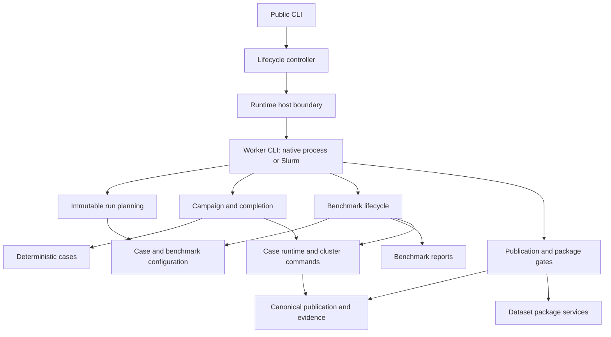

# Generation Operations

Generation uses the shared ICE repository, sibling durable storage, and native
Slurm/COMSOL execution. Scientific parameter meanings remain in the
[scientific parameter reference](generation_parameter_reference.md), and
current values remain in validated YAML under `configs/generation`.

## Everyday commands

Open the outer `grainlegumes-pino-drying` folder in VS Code Remote SSH and
select `runtime/venvs/native/bin/python` as the interpreter. In its terminal:

```bash
cd repo
export PATH="$(realpath -e ../runtime/venvs/native/bin):$PATH"
python -m pytest -q tests/generation/test_generation_run.py
./scripts/generation smoke
./scripts/generation run configs/generation/campaigns/steady_flow/id_dataset.yaml
./scripts/generation run configs/generation/benchmarks/transient_core_scaling/suite.yaml
./scripts/generation status configs/generation/campaigns/steady_flow/id_dataset.yaml
squeue -u "$USER"
ls -lt ../runtime/logs/generation | head
```

The small focused test above is suitable for development on the login node.
Run the full Generation suite in a CPU Slurm allocation. `smoke` submits a
disposable native COMSOL probe; for scientific paired technical smoke use
`./scripts/generation run configs/generation/workflows/technical_smoke.yaml`.
Repeat the same `run CONFIG` command to resume or replay eligible missing
work. `run` reads the validated configuration kind, so campaigns, benchmarks,
and ordered workflows need no different launch command. See the source
admission rules below before a publication run.

## Setup and entry points

Work from `repo/` on ICE. The sibling roots are `../storage` for
scientific data, case results, receipts, manifests, and Dataset packages, and
`../runtime` for the replaceable Python environment, caches, and Slurm
logs. No second checkout, self-SSH, rsync, Docker, or Conda runtime is used.

Provision `../runtime/venvs/native` once in a Slurm CPU allocation
from the repository's Python 3.12 `pyproject.toml` and `uv.lock`, including
the `dev` dependency group. This is the shared native environment for
Generation, VS Code/Pylance, Jupyter, and developer validation. Full project
dependencies are required because Generation package publication imports PyTorch.

```bash
srun --partition=gpu --nodes=1 --ntasks=1 --cpus-per-task=2 \
  --mem=8G --time=00:20:00 --pty bash -l
bash scripts/provision_native.sh
```

The bootstrap selects ICE's RPM-managed `/usr/bin/python3.12` directly,
not the module's convenience path under `/software`. The supported base was
verified as Python 3.12.14 on login and compute nodes. The script requires an
absent target and a Slurm allocation, disables Python downloads, and installs
the locked runtime and development dependencies. If needed, it copies ICE's
verified uv 0.11.7 from `/zfspool/software/uv/uv` to `../runtime/bin/uv`.

For a rebuild, first run `bash scripts/provision_native.sh --candidate` to
create `../runtime/venvs/native-candidate`. Validate imports, Generation venv
preflight, Jupyter, static checks and the synthetic test suite there, plus a
login-node probe. Quiesce users of the old environment before replacement.
Keep the old environment aside for rollback, then rerun the bootstrap without
`--candidate` at the now-absent canonical path. Do not promote a venv by moving
it: console scripts and Jupyter metadata embed absolute paths. Validate the
canonical environment before deleting the rollback copy and candidate.

`pyproject.toml` owns dependency intent; `uv.lock` owns resolved versions,
including the NeuralOperator Git revision. Normal provisioning must not
regenerate the lock. For intentional dependency changes, use the pinned uv with
`UV_CACHE_DIR="$(realpath -m ../runtime/uv/cache)" UV_PYTHON_DOWNLOADS=never ../runtime/bin/uv lock --python /usr/bin/python3.12`
inside a Slurm allocation, review the diff, then rebuild and validate. The
Apptainer image consumes the same lock without the development group; rebuilding
the native environment does not require rebuilding the SIF.

`scripts/generation` only starts the canonical native Python interpreter.
`src/generation/cli/cli_generation_controller.py` parses the public command;
`generation_controller.py` owns the run lifecycle, monitoring, continuation,
and publication sequence; and `runtime/generation_runtime_host.py` owns source
admission, host/Slurm command execution, and background process ownership.
Campaign, benchmark, completion, workflow, smoke, and background services own
their persisted evidence and scientific behavior. The shared
`scripts/generation_node.sh` is the Slurm node boundary, and
`scripts/generation_prerequisites.sh` checks modules and source identity
before node-side Python imports. Developers never invoke either shell file
directly for a normal workflow.

### Package responsibilities

The public controller reconstructs continuation from service-owned evidence.
`generation_run.py` describes immutable run plans and their declared stages;
it does not maintain another execution-state machine. The controller's command
port isolates real host processes from lifecycle decisions. Host service calls
cross the worker CLI because that boundary also selects the native interpreter,
checks source identity, and allocates Slurm resources when needed.

| Owner | Responsibility |
| --- | --- |
| `cli/` | Argument parsing, service dispatch, output, and process exit status |
| `generation_controller.py`, `generation_run.py` | Workflow sequencing and immutable plans |
| `generation_campaign.py`, `generation_campaign_completion.py` | Case admission, scheduler reconciliation, replacement completion, and resume |
| `generation_benchmark_config.py` | Benchmark suite validation and immutable resource/case selections |
| `generation_benchmark.py` | Benchmark work-unit execution, recovery, and persisted evidence |
| `generation_benchmark_report.py` | Measurement interpretation and deterministic CSV/Markdown reports |
| `cases/`, `contracts/` | Scientific configuration, deterministic inputs, admission, and semantic contracts |
| `runtime/` | Admitted host processes, case commands, COMSOL execution, scratch ownership, and runtime evidence |
| `publication/` | Canonical export conversion, case/attempt admission, inventories, and composite evidence |
| `generation_workflow.py` | Dataset-package gates, retention, cleanup authorization, and workflow receipts |
| `generation_smoke.py`, `generation_readiness.py`, `validation/` | Technical smoke evidence, readiness, pilot analysis, and scientific gates |
| `generation_campaign_status.py`, `generation_background.py` | Status presentation and durable controller-session evidence |

<details>
<summary>Dependency and execution boundaries</summary>



Benchmark configuration and reporting have no dependency on the benchmark
lifecycle. Generic paths, serialization, and locking remain in `src/common`;
Generation-specific admission and source-evidence rules remain in Generation.
The deliberate local-import dependency between completion and campaign evidence
admits synthetic replacement manifests through their existing semantic owner.
Completion consumes the canonical parent partial receipt directly, with storage
containment checked by the controller and exact digest/schema admission by the
completion service.

</details>

Run the maintained checks from `repo/` in a CPU Slurm allocation, with
`native-candidate` substituted for `native` during staged validation:

```bash
export PATH="$(realpath -e ../runtime/venvs/native/bin):$PATH"
export UV_CACHE_DIR="$(realpath -e ../runtime/uv/cache)"
export RUFF_CACHE_DIR="$(realpath -m ../runtime/cache/ruff)"
export MYPY_CACHE_DIR="$(realpath -m ../runtime/cache/mypy)"
../runtime/bin/uv pip check --python "$(command -v python)"
python -m ruff check src tests scripts/check_notebooks.py scripts/check_package_install.py
python -m ruff format --check src tests scripts/check_notebooks.py scripts/check_package_install.py --exclude '*.ipynb'
python -m mypy src
python -m basedpyright --pythonpath "$(command -v python)"
python -m pytest -q -m 'not real_data' -p no:cacheprovider tests
for script in scripts/*.sh; do bash -n "$script"; done
bash -n scripts/generation
git diff --check
```

For small environment
builds and validation, prefer a CPU-only allocation on `gpu` when capacity
is available, without GPU GRES or node pinning; otherwise use `standard`.
Use `standard` for substantial CPU work. Do not install the full dependency
set on the login node. COMSOL is loaded
natively on compute nodes with `module load Comsol/v6.4`; it is not in
the ML Apptainer image.

Use `./scripts/generation run CONFIG --dry-run` to inspect a plan and
`./scripts/generation run CONFIG --preflight-only` to check launch readiness.
The optional `--background` flag starts the same run under a durable controller
session. `status CONFIG_OR_RUN_ID` and `cancel RUN_ID` are the administrative
commands.

The optional `smoke` command submits one disposable COMSOL batch
acceptance job with one CPU, no GPU GRES, and no scientific publication.
It defaults to the `gpu` partition for a lightweight probe; the
`standard` partition can be requested explicitly. Slurm logs go to
`../runtime/logs/generation`. Normal Generation cases use
`standard` or `long` according to their configured runtime.
No physical node is selected by the workflow.

| Workflow | Configuration |
| --- | --- |
| Paired technical smoke | `configs/generation/workflows/technical_smoke.yaml` |
| Transient core benchmark | `configs/generation/benchmarks/transient_core_scaling/suite.yaml` |
| All-material pilot | `configs/generation/campaigns/transient_drying/material_pilot.yaml` |
| Transient production | `configs/generation/campaigns/transient_drying/family_generalization.yaml` |
| Airflow ID Dataset | `configs/generation/campaigns/steady_flow/id_dataset.yaml` |

## Source admission and lifecycle

`run CONFIG` is the maintained start and resume entry point. It requires
the current shared HEAD to be clean and committed; `--git-commit` may
assert that same revision but cannot select a different checkout. The
controller fingerprints the source. Workers check the exact commit and
fingerprint before execution; the Python orchestration worker checks again
afterward. Publication checks the fingerprint immediately before its atomic
write. A changed
source fails closed. Keep the shared checkout unchanged while jobs are active;
to resume an older run, check out its admitted revision after dependent jobs
have finished. A dirty worktree cannot be labeled with a clean commit for
scientific publication.

Each config resolves to a deterministic Generation run plan. The controller
prepares missing canonical inputs, submits eligible Slurm cases through the
existing Python admission owner, monitors jobs and case evidence, validates
native COMSOL results, binds the in-place campaign or benchmark publication,
and runs the existing Dataset and finalizer services. Repeating the config
reconciles active ownership and submits only eligible missing work. Slurm
`COMPLETED` alone is never scientific success.

Immutable inputs keep their `input_generation_id` and source commit.
Cross-commit input reuse requires exact scientific, template, schema, batch,
and ordered case-membership compatibility. The execution run identity still
includes its execution commit. Solver outputs are not reused merely because
inputs are compatible. Source, template, config, input, case, and publication
hashes remain owned by the Python services.

`--background` changes only the controller's ownership to a `tmux`
session. Slurm still owns the case jobs. A login-host reboot can end the
controller; rerun the same config to reconcile durable state.

```bash
./scripts/generation run CONFIG --background
./scripts/generation background-status "$WORKFLOW_SESSION_ID"
./scripts/generation background-list
```

## Partial campaigns and completion

A genuine terminal partial campaign retains successful cases, failed-case
evidence, and original membership. Complete and partial publication receipts
bind exact in-place inventories under the sole shared storage root. There is
no transfer copy or remote-source cleanup. Package and finalizer validation
still fails closed on missing or conflicting evidence.

Deterministic completion uses the same interface:

```bash
./scripts/generation run CONFIG --replacement-pool-size N
./scripts/generation run CONFIG \
  --replacement-pool-size N --parent-run-id PARENT_RUN_ID
```

`N` is a cumulative high-water mark, not an additional count per
invocation. The replacement pool extends a stable deterministic candidate
prefix. A failed candidate releases only its own material's deficit slot;
successful original cases are never rerun. Compatible parents are selected by
validated structure, not filename or modification time. Ambiguous matches
require `--parent-run-id`. Parent partial evidence is bound within shared
storage. After all deficits are covered, the existing Python services build
the exact composite, Dataset packages, transient PT shards, loader smoke,
readiness evidence, and final receipts. Failed sources remain visible and
the sole durable source is retained.

## COMSOL and failure behavior

Each case loads `Comsol/v6.4` in its Slurm allocation and executes Python
through the canonical native venv. The `python_module: Python/3.12` site field
is retained as the declared version contract for preflight; it is not loaded.
The site Python probe uses `/usr/bin/python3.12` directly.
The single native node launcher invokes the maintained Generation Python CLI;
the Python runtime constructs and executes `comsol batch` with the
existing inputs, `-batchlog`, and `-batchlogout`. The worker
uses unique node-local scratch and removes it after case completion. COMSOL
exit status and license errors propagate into the existing attempt/failure
evidence; no shell retry can publish duplicate science.

Temporary license capacity is recognized only by the existing strong
feature-bearing classifier. The first checkout after allocation is immediate;
strong pre-solve capacity failure retries in the same allocation according to
the configured `in_allocation_retry` window and pause. Unknown, expired,
missing, or misconfigured licenses remain hard failures. License-only blocks
are operational evidence, not scientific failed attempts. Solver, conversion,
publication, and replay failures retain their stage-specific evidence. One
case failure does not cancel unrelated runnable cases. Duplicate job ownership,
incompatible identities, unsafe paths, and conflicting hashes fail closed.

`maximum_failed_cases` remains inclusive: the circuit opens at the
next genuine solver failure. Slurm pending time does not enter the license
window. Do not cancel or move a valid pending job based only on estimated
start time.

A finalized `comsol_batch.log` is parsed once into compact timing
evidence. `comsol_process_seconds` is whole-process wall time; the
stationary and transient scientific solver times come only from their matched
top-level COMSOL solver blocks. Missing or ambiguous timing remains
unavailable without reclassifying a valid scientific result.

## Input-only generation and status

Normal `run CONFIG` prepares missing canonical inputs. For a bounded
input-only operation, the maintained wrapper admits the current clean source
and runs the Python CLI inside a CPU Slurm allocation:

```bash
./scripts/generation inputs "$CAMPAIGN_CONFIG" \
  --only-batch "$BATCH_NAME" --case-start 1 --case-count "$CASE_COUNT"
```

The wrapper uses the configured native Python 3.12 environment, the current
source commit, and sibling storage. Input EDA reads only admitted canonical
manifests.

```bash
./scripts/generation status CONFIG_OR_RUN_ID
./scripts/generation cancel "$GENERATION_RUN_ID"
./scripts/generation cancel "$GENERATION_RUN_ID" --force
```

The first Ctrl+C after campaign launch requests graceful cancellation of
owned work; the second requests force cancellation. Before a run identity
exists, cancellation is not armed. Status reports bounded successful and
failed case views, admission occupancy, license blocks, and incomplete work
without reading large HDF5/CSV payloads.

## Persistence

`../storage/01_generation` owns canonical inputs, cases, attempts, run
and pilot evidence; `../storage/02_datasets` owns immutable Dataset
packages. Packages reference validated `case.h5` sources rather than
copying them. The same-root campaign receipt binds an exact inventory and
preserves the existing atomic publication and collision checks. The pilot
uses a marked accounting workspace containing no copied scientific cases,
then removes that workspace after its finalizer; the canonical source stays
in storage. Benchmark validation uses its exact same-root validator. Slurm
stdout/stderr and replaceable cache belong under `../runtime`.

The core benchmark still uses its configured cases and variants. Its primary
measurement is successful COMSOL process time; queue, license wait, failed
checkout, conversion, publication, and controller time remain separate. It
reports a recommendation without editing production configuration.
